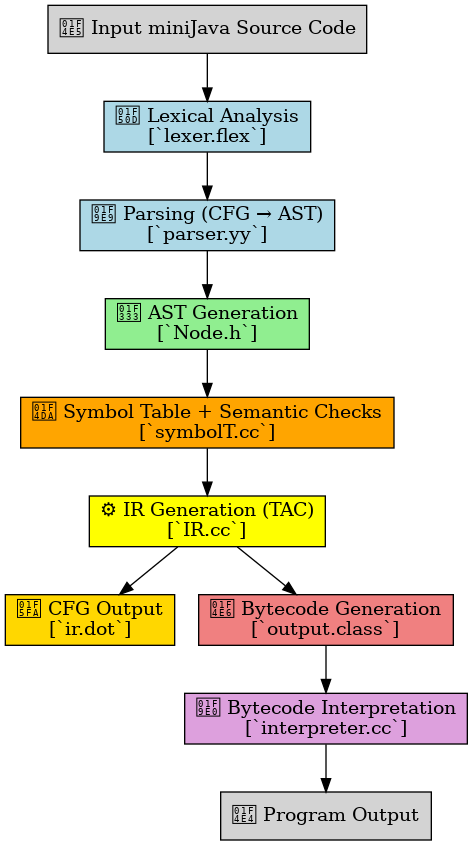

# miniJava Compiler

A minimal compiler for the miniJava language, built as part of a compiler design course. It features a full pipeline: lexical analysis, parsing, AST generation, semantic analysis, IR generation, control flow graph generation, and bytecode interpretation.

<p align="center">
  
</p>

## Features
- Lexical Analysis using Flex
- Parsing using Bison
- AST construction
- Semantic analysis with custom Symbol Table
- Intermediate Representation (IR) generation
- Control Flow Graph (CFG) output
- Bytecode generation and interpretation

## File Structure
- `lexer.flex`: Lexical analyzer (tokens)
- `parser.yy`: Parser (grammar rules)
- `Node.h`: AST structure and DOT generator
- `symbolT.cc`: Symbol table & semantic analysis
- `IR.cc`: IR generation and CFG creation
- `interpreter.cc`: Stack-based bytecode interpreter
- `main.cc`: Compiler driver

## Build
### Compiling the compiler
```bash
make
````
### Compiling the interpreter
```bash
make interpreter
```

## Run
### Running the compiler
```bash
./compiler <miniJavaFileName>
````
### Running the interpreter - Interprets/Runs the bytecode file
```bash
./interpreter <output.class>
```

## Developers 
@me & https://github.com/FelixCenusa
